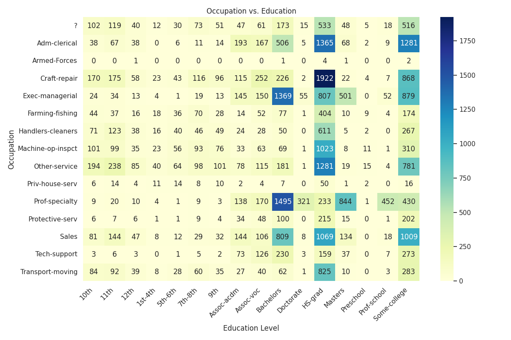
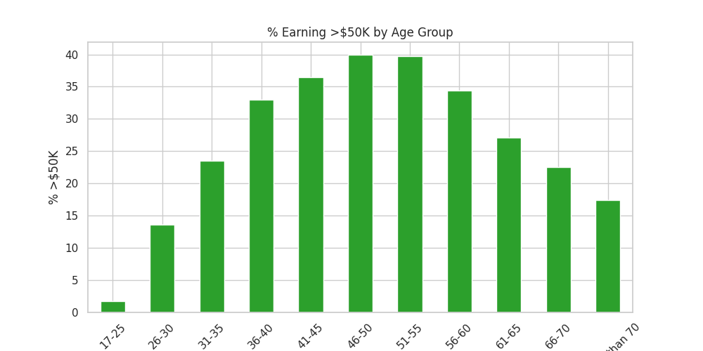
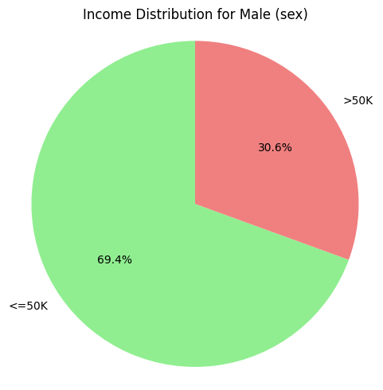
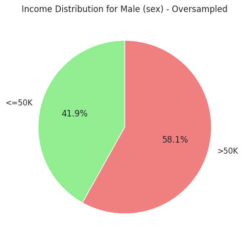
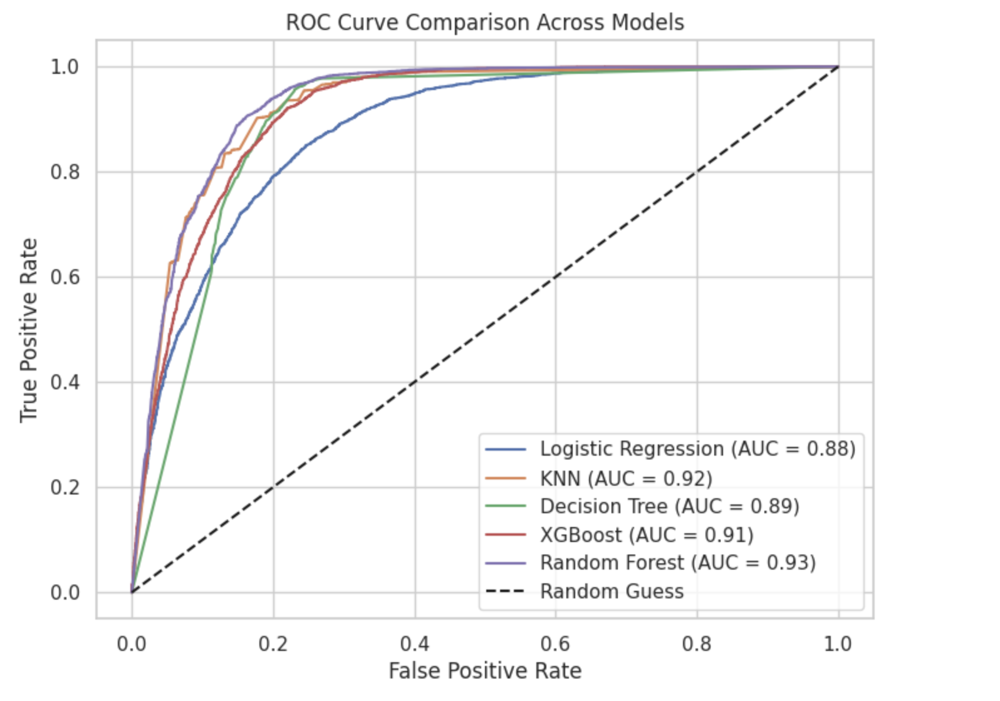
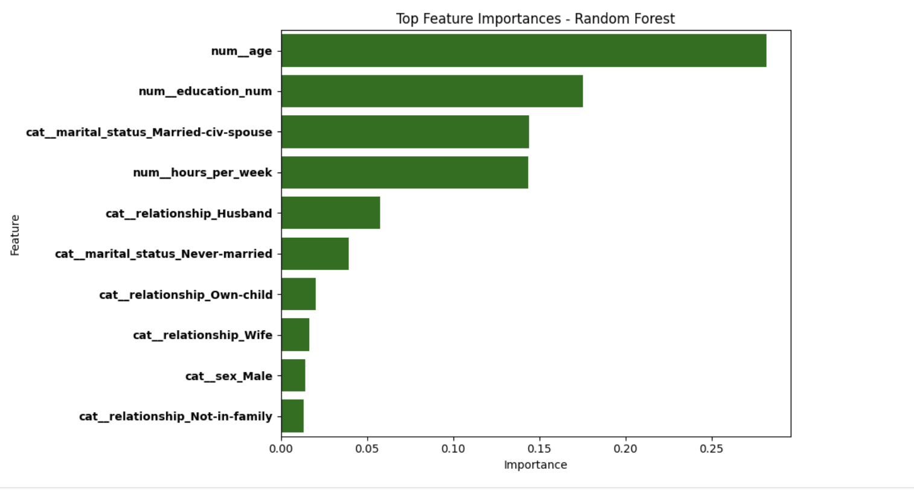

# Predicting Income Level Using Census Data  
### A Comparative Analysis of Machine Learning Models 

**Contributors:**  
- Sadia Mohammed (sadiamohammedh@gmail.com)  
- Amal Hassan (almaahsa45@gmail.com)  
- Asia Mohamud (mohamudasia6@gmail.com)

**Abstract**  
This report analyzes the U.S. Census Income dataset to predict whether individuals earn above or below $50,000 annually. We use comprehensive data preprocessing, including missing value imputation, feature selection, and class balancing, followed by evaluating five machine learning models. Our analyses identified age, education, and marital status as the strongest predictors of income, while revealing systemic disparities across demographic groups. The Random Forest Classifier achieved the highest performance, demonstrating effectiveness of our methodology.  

**Keywords:** income prediction, census data, machine learning, classification, feature importance  

## Table of Contents
- [I. Introduction](#i-introduction)
- [II. Related Work](#ii-related-work)
- [III. Dataset Overview](#iii-dataset-overview)
- [IV. Exploratory Data Analysis](#iv-exploratory-data-analysis)
- [V. Preprocessing](#v-preprocessing)
- [VI. Methodology](#vi-methodology)
- [VII. Results and Discussion](#vii-results-and-discussion)
- [VIII. Conclusion & Future Work](#viii-conclusion--future-work)
- [IX. References](#ix-references)

## I. Introduction
Income prediction is a frequently occurring machine learning challenge, where models learn to extract signals from complex patterns. We analyze the 1994 U.S. Census dataset—32,561 records with 14 features related to demographic and employment characteristics—to classify whether individuals earn above or below $50,000 annually. This threshold provides a clean binary split that reflects meaningful economic classification while presenting a realistic 3:1 class imbalance for model testing.  

Our work pursues two equally important objectives:
- **Technical Performance:** Evaluating five classifiers (Logistic Regression, KNN, Decision Trees, Random Forest, and XGBoost) across different feature representations  
- **Interpretable Insights:** Identifying which factors (education, marital status, age) most influence predictions, and how these relationships vary across demographic groups  

The analysis reveals which models perform best and why certain patterns persist:
- Which features (education, age, marital status) drive predictions  
- How different algorithms handle inherent class imbalance  
- Where models agree or disagree  

By combining rigorous modeling with careful interpretation, we transform raw census data into actionable knowledge, demonstrating how our predictive machine learning models help reveal the complex stories behind data.

## II. Related Work
Chakrabarty and Biswas (2018) [3] adopted a statistically grounded approach to income prediction. They demonstrated the potential of Gradient Boosting Classifiers for census income prediction, reporting 88.16% accuracy through hyperparameter optimization. While their work provided a valuable case study of ensemble methods on this dataset, they did not explore:

- Feature selection trade-offs (e.g., retaining fnlwgt despite its low predictive value)  
- Demographic disparities in model performance across subgroups  
- Handling class imbalance beyond basic preprocessing  

Our work extends this foundation by:
- Implementing extensive EDA-driven feature selection (vs. their Extra Trees-only approach)  
- Evaluating modern classifiers (XGBoost, Random Forest) not used in their study  
- Using oversampling methods to address the class imbalance  

## III. Dataset Overview
The dataset used is the UCI Census Income dataset, derived from the 1994 U.S. Census Bureau Current Population Survey (CPS). It contains over 32,000 records capturing demographic and employment characteristics including age, sex, education, marital status, occupation, and hours worked per week.  

While rich in detail, this dataset introduces bias concerns. The "fnlwgt" feature was excluded from modeling due to its design-specific role. Features like race and sex reflect societal inequalities, so model outputs must be interpreted with caution. The target variable is binary income classification (≤50K or >50K), evaluated using accuracy, precision, recall, and AUC metrics.

## IV. Exploratory Data Analysis
### A. The Role of Sampling Weights
The fnlwgt variable adjusts the survey sample to reflect national population demographics. Median weights showed that Black respondents were the most overrepresented. While fnlwgt was essential for understanding dataset design, it held little predictive power and was dropped.

### B. Education as an Engine of Mobility
Analysis of "education_num" revealed a near-linear correlation with income. A chi-square test confirmed the relationship (χ² = 4429.65, *p* < .001). Education correlated strongly with occupation type and income level.

  
**Figure 1:** Occupation vs. Education

### C. Marital Status Over Occupation
Marital status was a stronger predictor of income than occupation. Married individuals dominated the peak earning years (46–55), while never-married respondents were concentrated in lower-income, younger age brackets.

### D. Age Matters—But Only Up to a Point
Income rose until age 55 and declined afterward. White and Asian workers consistently out-earned Black and Hispanic peers at every age group.

  
**Figure 2:** % Earning >$50K by Age Group

## V. Preprocessing
### A. Handling Missing Values
All "?" values were converted to NaN and imputed within a pipeline to avoid data leakage.

### B. Feature Selection and Dropping
Features removed included:  
- education (duplicate of education_num)  
- capital_gain/capital_loss (zero-inflated)  
- fnlwgt, native_country, and occupation (low predictive value or high missingness)

### C. Addressing Class Imbalance
Random oversampling was used to address the 3:1 imbalance in income classes. This notably improved model performance, especially for male subgroups.

  
**Figure 3:** Men Income Distribution - Before Sampling  
  
**Figure 4:** Men Income Distribution - After Sampling

### D. Pipeline Construction
Preprocessing was standardized using ColumnTransformer:
- **Numerical:** median imputation + standardization  
- **Categorical:** most-frequent imputation + one-hot encoding  
- **Target:** binary label encoding  

## VI. Methodology
### A. Feature Selection
Backward Elimination (statsmodels.OLS, α=0.05) retained key features such as age, education_num, and sex_Male.

### B. Dimensionality Reduction
- **LDA:** 1 component for class separation  
- **PCA:** 2 components for visualization and variance  
- **Kernel PCA (RBF):** captured non-linear patterns

### C. Classification Models
We evaluated 5 classifiers across full, reduced, and transformed feature sets:
- Logistic Regression  
- K-Nearest Neighbors (KNN)  
- Decision Tree  
- Random Forest  
- XGBoost  

### D. Hyperparameter Tuning
Used GridSearchCV for model-specific parameters:
- Tree models: estimators, depth, splits  
- KNN: k-values, distance metrics  
- Logistic: regularization, solver  

## VII. Results and Discussion
### A. Dimensionality Reduction Impact
Despite fewer features, performance stayed strong:
- **LDA:** 86%  
- **PCA:** 86%  
- **Kernel PCA:** 84%  

### B. Reduced Feature Model Performance

| Model               | Accuracy | Precision        | Recall         | AUC  |
|---------------------|----------|------------------|----------------|------|
| Random Forest       | 0.86     | 0.93 / 0.82      | 0.79 / 0.94    | 0.93 |
| KNN                 | 0.85     | 0.91 / 0.80      | 0.77 / 0.93    | 0.92 |
| Decision Tree       | 0.86     | 0.92 / 0.81      | 0.78 / 0.93    | 0.89 |
| XGBoost             | 0.83     | 0.87 / 0.79      | 0.76 / 0.89    | 0.91 |
| Logistic Regression | 0.80     | 0.84 / 0.77      | 0.74 / 0.86    | 0.88 |

**Table I:** Performance Metrics of Classification Models

### C. Full Feature Model Performance

| Model               | Accuracy | Precision    | Recall       | AUC  |
|---------------------|----------|--------------|--------------|------|
| Random Forest       | 0.87     | 0.93 / 0.82  | 0.79 / 0.94  | 0.93 |
| Decision Tree       | 0.86     | 0.92 / 0.81  | 0.78 / 0.93  | 0.89 |
| KNN                 | 0.85     | 0.92 / 0.80  | 0.76 / 0.94  | 0.92 |
| XGBoost             | 0.85     | 0.90 / 0.81  | 0.78 / 0.92  | 0.92 |
| Logistic Regression | 0.80     | 0.84 / 0.77  | 0.74 / 0.86  | 0.88 |

**Table II:** Full Feature Model Performance

### D. Final Model Selection and Key Insights
Random Forest with the full feature set was selected as the final model.  

  
**Figure 5:** ROC Curves Comparison Across Models  

  
**Figure 6:** Top 10 Most Important Features

## VIII. Conclusion & Future Work
Random Forest proved to be the most reliable model. Dimensionality reduction (LDA) and feature elimination (backward selection) yielded strong results while reducing complexity. Oversampling helped address class imbalance.

**Future Work:**
- Use more recent or diverse income datasets  
- Explore advanced ensemble and deep learning models  
- Improve model efficiency and fairness  

## IX. References
[1] R. Kohavi and B. Becker, “UCI Adult Census Income Dataset,” UCI ML Repository, 1996.  
[2] R. Kohavi and B. Becker, “Adult Census Income,” Kaggle, 1996.  
[3] N. Chakrabarty and S. Biswas, "A Statistical Approach to Adult Census Income Level Prediction," ICACCCN, 2018. DOI: 10.1109/ICACCCN.2018.8748528.  
